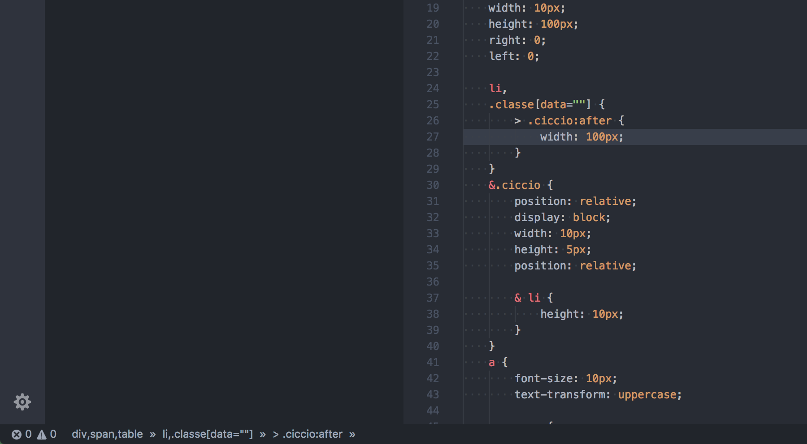

# Sass YAH 🤙

This simple extesion is to make SCSS more legible in very large SCSS file

---------------------------

## To Do

* Make node clickable
* Write best readme 🙃

### For report a 🐛 

[Github Repo](https://github.com/tomma5o/vscode-sassYah)

**Enjoy!**